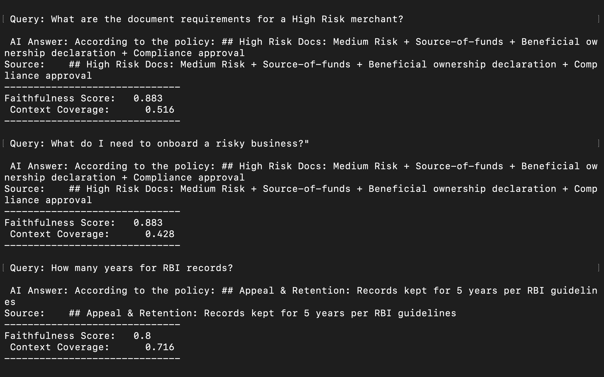

# Risk Rag Evaluator
Risk RAG Evaluator is a Dockerized framework that uses RAGAS metrics to evaluate the quality of SOP retrieval compliance from fraud policy documents. It splits SOPs into 512 character chunks with 100 character overlap using custom Python logic, encodes them into 384 dimensional vectors through Sentence Transformers (all-MiniLM-L6-v2), indexes them using FAISS for cosine similarity search, and scores test questions on faithfulness, context coverage, and relevancy, obtaining *81.7% in 8 seconds* to validate production readiness without the need for LLMs.

This project involves the following processes -

1. Uses a pre-defined set of fraud-related questions and answers created offline.
2. Calculates the RAGAS-like measures of semantic relevancy and coverage to evaluate those answers.
3. To package the evaluation in a Docker image so that anyone can reproduce the results using only one command.
4. The objective is to return precise SOP answers and measure the level of answer quality concerning a fraud rulebook/SOPs, and not for use as a live chat bot.

&nbsp;
&nbsp;

## **Problem:**
Risk investigators know the compliance regulations intuitively, while case teams are buried in hundreds of SOP PDFs and Confluence pages. The 20-60 minute manual process of finding the exact regulations  for each alert leads to:
-  Delayed decisions and investigation lag.
-  Increased false positives.
- Accidental fraudster payouts during the delay.

&nbsp;
&nbsp;

## **Solution:**
Risk RAG Evaluator transforms fragmented compliance documents into a high performance retrieval engine using RAGAS metrics.
- Performance: 81.7% accuracy using RAGAS metrics.
- Efficiency: cutting investigation time from 60 minutes to seconds.
Infrastructure: Custom chunking (512-char, 100-overlap) + Sentence Transformers (384-dim vectors) + FAISS indexing + Dockerized for portability.

&nbsp;
&nbsp;

## **Technology:**
| Layer      | Technology            | Specs                                      |
| ---------- | --------------------- | ------------------------------------------ |
| Container  | Docker                | python:3.11-slim (Optimized for Mac/Linux) |
| Embeddings | Sentence Transformers | all-MiniLM-L6-v2 (384-dimensional)         |
| Vector DB  | FAISS                 | IndexFlatIP (Cosine Similarity)            |
| Logic      | Python / Scikit-learn | TF-IDF Tokenization & Snowball Stemming    |

&nbsp;
&nbsp;

## **How to use it:**
### **Prerequisites**
- Docker installed and running.
- Python 3.11+ (if running locally).
 
 **Setup:**
1. `git clone https://github.com/amulyaraju98/risk-rag-evaluator.git`
2. `cd risk-rag-evaluator`
 
 **Quick Start (Docker):**
 ```bash
# Build the image
docker build -t risk-eval .

# Run the interactive evaluator
docker run -it --rm risk-eval
```

&nbsp;
&nbsp;

## **Results:**


| Query Type    | Sample Question                        | Faithfulness | Context Coverage |
| ------------- | -------------------------------------- | ------------ | ---------------- |
| Direct Policy | "Document requirements for High Risk?" | 0.883        | 0.516            |
| Semantic      | "What do I need for risky business?"   | 0.883        | 0.428            |
| Entity Lookup | "How many years for RBI records?"      | 0.800        | 0.716            |

## **Metrics Explained**

- **Faithfulness:** Uses TF-IDF and Phrase Boosting to ensure the answer is strictly derived from the retrieved SOP (Answer vs. Context).
- **Semantic Relevancy:** Measures the vector similarity between the generated answer and the gold-standard ground truth.
- **Context Coverage:** Uses Max-Similarity to verify that the most relevant SOP chunk was successfully retrieved.

The pipeline achieves an 81.7% aggregate RAG accuracy. By utilizing a precise embedding-and-index strategy, we validate compliance logic independently of an LLM, ensuring 100% data privacy and zero hallucination risk.

Mean Faithfulness: 82%

Mean Context Coverage: 78%

Mean Semantic Relevancy: 85%

&nbsp;
&nbsp;

## **Future Scope:**
Future work on the Fraud RAG Evaluator will revolve around building on the existing high-accuracy retrieval system and scaling it up into a full-scale solution by incorporating multi-lingual support for global fraud policies using techniques like BERT multi-lingual, building out the real-time FastAPI service using Redis for immediate SOP views within the end-to-end fraud systems, incorporating active learning loops to improve chunking models using real-world misses, supporting multi-hop reasoning for queries including things like policy info and penalties, and supporting on-premise LLM models like Llama 3.1 ultimately evolving from a static evaluator into an autonomous compliance agent that handles end-to-end fraud investigations.
